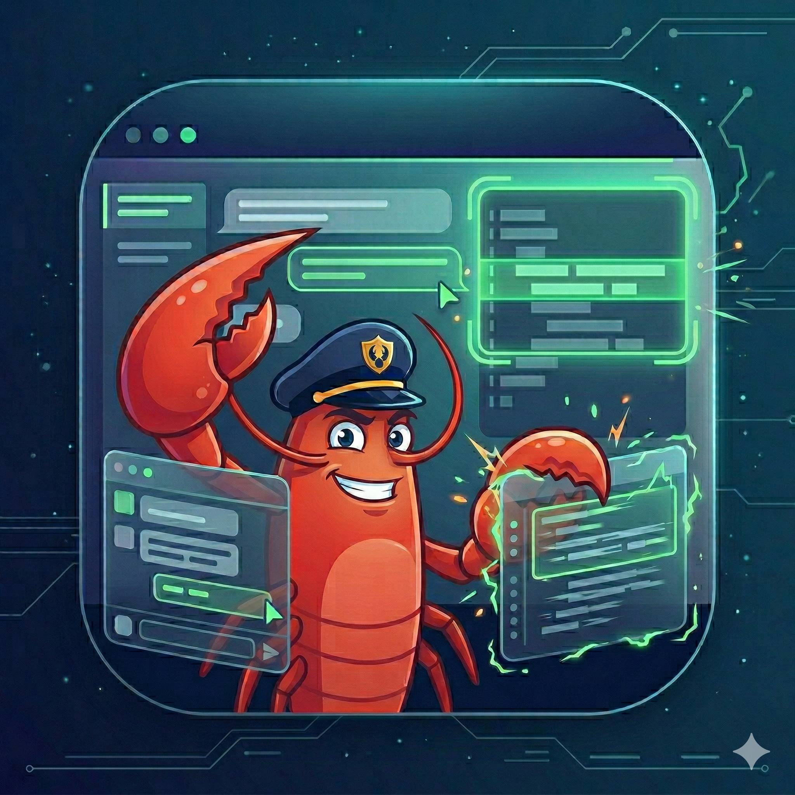

# CodeLeader for OpenClaw

<table width="100%">
  <tr>
    <td align="left"><a href="README.zh-CN.md">中文版本</a></td>
    <td align="right"><a href="README_AGENT.md">Agent Edition</a></td>
  </tr>
</table>

<p align="center">
  
</p>

**CodeLeader turns OpenClaw into a project manager for terminal-native coding agents like Claude Code, Codex, OpenCode, and Gemini CLI — tracking execution, correcting drift, handling approvals, reporting progress, and bringing in the human only when needed.**

> **These are terminal-native coding agents, not IDEs like VS Code. They execute the work in a real remote terminal session. OpenClaw stays on top of the project, and the human can step in through OpenClaw or directly in the remote session at any time.**

**Status:** First public open-source release. Claude Code workflow validated. Broader tool coverage is in progress.

## Core capabilities

- manage a project's development progress through a real remote coding session
- push coding work into terminal-native coding agents like Claude Code, Codex, OpenCode, and Gemini CLI
- keep OpenClaw following the run and correcting drift when execution goes off track
- let OpenClaw handle routine approvals first and bring in the human only when needed
- report progress through OpenClaw's channels, such as Telegram or WhatsApp, when the human wants visibility
- support takeover through OpenClaw or directly in the remote coding session
- continue from the live terminal state after OpenClaw or human intervention

## What CodeLeader actually does

CodeLeader is built for cases where the real execution environment is already remote:
shared servers, lab machines, cloud dev boxes, multi-device workflows, or projects that already live on a remote machine.

Instead of pulling the work back into a local IDE or treating coding AI as a swarm of protocol-level agents, CodeLeader keeps the execution inside a real remote terminal session and lets OpenClaw manage the run from above.

Example flow:

1. You ask OpenClaw to fix a bug or implement a feature in a project that lives on a specific remote machine.
2. OpenClaw keeps the execution on that remote machine, inside the coding session where the project and compute already live.
3. OpenClaw keeps following the run, steering it back on course and handling routine approvals.
4. If real human judgment is needed, OpenClaw asks.
5. If you want to step in, you can do it through OpenClaw or directly in the remote session.
6. The work then continues from the current real state.

## Who this is for

CodeLeader is a good fit if you:

- already rely on terminal-native coding agents like Claude Code, Codex, OpenCode, or Gemini CLI in your workflow
- want to use those tools anytime, instead of only when you are physically at the screen and keyboard
- run those tools on a remote machine, shared server, lab box, or cloud dev environment
- want to assign work without staying glued to the terminal the whole time
- still want approvals, visibility, and human takeover when things get risky or ambiguous

## Who this is not for

CodeLeader is probably not the right fit if you are looking for something else, such as:

- a fully autonomous black-box coding agent with no human checkpoints
- a local desktop IDE replacement as the primary product
- a workflow that stays entirely local and does not need a remote execution lane
- a workflow centered on a local GUI environment rather than a remote execution lane

## Why this exists

Most coding-AI workflows still force a bad tradeoff:

- use coding AI tools like [Claude Code](https://www.anthropic.com/claude-code), [Codex](https://openai.com/codex/), [OpenCode](https://opencode.ai/), or [Gemini CLI](https://github.com/google-gemini/gemini-cli) directly, and still stay tied to the screen
- let agents run in the background, and lose visibility and control
- use desktop wrappers, and still end up supervising everything live
- enable dangerous permissions, and accept too much risk for long-running sessions
- switch between tools, and lose any consistent control model

**CodeLeader is built for the middle path.**

It keeps the **human** and **OpenClaw** on the **same layer**:
- looking at the same real working surface
- reacting through the same control loop
- deciding together when to hand work to a lower execution layer

That lower layer is a real remote coding session.

This matters because, in many real workflows, the code and compute are already remote — especially in research, shared servers, and remote compute environments. In those setups, the remote machine should stay the execution lane, not become the user's personal control plane.

So CodeLeader keeps:
- **OpenClaw local**
- **the coding agent remote**
- **the human in the loop**

Human takeover is built in.
A human can directly take over the remote coding agent conversation at any time, or inject a new instruction immediately. OpenClaw handles the decisions it can handle, and only escalates to the human when the situation actually needs human judgment. When the intervention is over, OpenClaw re-reads the current state, understands what changed, and continues from the new reality instead of blindly resuming an old plan.

## What this gives you

- **Less screen babysitting** — the human does not need to sit in front of the terminal for the entire run.
- **Less blind automation** — OpenClaw stays in the loop instead of disappearing into an opaque background process.
- **Cleaner handoff** — the human can step in, change direction, then let OpenClaw continue from the new state.
- **Lower token burn** — hook-driven observation means OpenClaw checks in when it needs to, instead of continuously polling the screen.
- **Safer long-running sessions** — explicit approval points are better suited than permanently over-privileged execution modes.
- **Terminal-native execution** — coding tools can stay where they are strongest: on the remote machine, inside a real terminal session.
- **One operational model across tools** — even if the lower-layer coding tools do not share one unified protocol, CodeLeader gives the upper workflow a more consistent control loop.

## What works now

- ✅ **Validated now:** [Claude Code](https://www.anthropic.com/claude-code)
- 🧭 **Planned next:** [Codex](https://openai.com/codex/), [OpenCode](https://opencode.ai/), [Gemini CLI](https://github.com/google-gemini/gemini-cli), and other terminal-native coding agents
- ✋ **Approvals stay controlled:** CodeLeader keeps approval decisions in the human/OpenClaw loop instead of silently pushing forward
- 🔄 **Human takeover is built in:** when a human steps in, automatic actions pause; when the human is done, OpenClaw continues from the new state
- 🖥️ **GUI:** desktop GUI is planned, but not the current focus
- 🧪 **Tested setup:** local **macOS** + remote **Ubuntu**
- ⚠️ **Not fully covered yet:** more platform combinations, deployment styles, and coding-agent combinations still need validation

## Requirements

### Local side

Before using CodeLeader, make sure:
- OpenClaw gateway is running on your local trusted machine
- your local machine can reach the remote machine over SSH

### Remote side

Before using CodeLeader, make sure the remote machine has:
- [Zellij](https://zellij.dev/) (`0.43.0`)
- [tmux](https://github.com/tmux/tmux/wiki)
- at least one coding agent CLI installed (for example [Claude Code](https://www.anthropic.com/claude-code), [Codex](https://openai.com/codex/), [OpenCode](https://opencode.ai/), or another terminal-native coding tool)
- a writable workdir for the project

## Quick start

You only need three things to get started:

1. **Install the CodeLeader release bundle** into your OpenClaw skills directory
2. **Make sure your local machine can SSH to the remote machine** where the coding tool will run
3. **Ask OpenClaw to use CodeLeader** for a real task

Example:

```text
Use CodeLeader to build a Pomodoro timer app with task tracking.
```

OpenClaw should then collect any missing startup information and bring the stack up through the skill bundle.

When you want to join the shared working surface yourself:

```bash
ssh <remote-host>
codeleader show
```

This opens the remote CodeLeader session directly.

### Bundle layout

The unpacked release folder should be:

```text
codeleader/
```

## For developers: direct launcher usage

If you are operating the bundle directly, the main entrypoint is:

```bash
./scripts/start_codeleader_stack.sh --recreate
```

Typical required environment variables:

```bash
export CODELEADER_REMOTE_SSH_HOST="<remote-host>"
export CODELEADER_REMOTE_REPO_DIR="<remote-repo-dir>"
export CODELEADER_OPENCLAW_SESSION_ID="<current-openclaw-session-id>"
```

## Things to know

- If local port `8787` is still occupied after `down.sh`, startup stops and shows which process owns the port.
- To explicitly force-take the port, rerun with:

```bash
CODELEADER_FORCE_KILL_8787=1 ./scripts/start_codeleader_stack.sh --recreate
```

- If the remote workdir does not exist yet, the startup path will create it.
- The main launcher is the normal entrypoint; you usually do not need to run the lower-level helper scripts directly.
- The project currently favors a conservative control model: one prompt at a time, then wait for the next hook.

## Contact

For questions, feedback, or collaboration, please contact:

- `kunyan.cai@icloud.com`

## License

MIT
